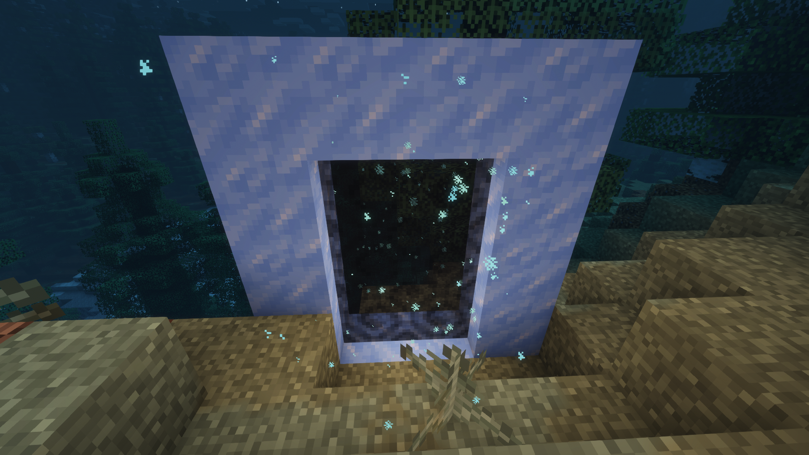

# The Frost Portal (Fabric)

## Description

This mod simply adds a Portal to the "The Frost" - Dimension of the similarly
named Datapack. Found [here.](https://www.planetminecraft.com/data-pack/the-frost-1-18-dimension-wip/)

### Portal Frame and Lighter

The Frame uses Packed Ice Blocks 
and you light the portal with the normal flint and steel.

## License

[GPL-3.0](LICENSE)
